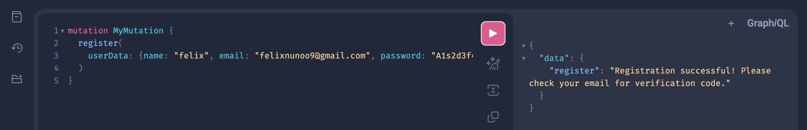

# Admin Flow:

**Goal**: Manage the platform, oversee events, and moderate users.

**Flow**:

1. Login
   - Admin logs in with email/password.
   - If already logged in elsewhere, old session is invalidated.
2. Dashboard
   - View platform-wide analytics (total events, total attendees, revenue).
   - See most popular categories and events.
3. User Management
   - View all users.
   - Activate/deactivate accounts.
   - Delete accounts if necessary.
4. Event Oversight
   - View all events.
   - Remove inappropriate events.
   - Monitor ticket sales and RSVPs.
5. Logout
   - Ends the current session (refresh token deleted).

# Organizer Flow:

**Goal**: Create and manage events, track attendees, and handle check-ins.

**Flow**:

1. Register/Login
   - Organizer signs up or logs in.
   - If logging in, any old session is invalidated.
2. Create Event
   - Fill in event details (title, description, category, location, dates, ticket types).
   - Upload cover image.
   - Publish event.
3. Manage Events
   - View list of their events.
   - Edit event details.
   - Cancel events if needed.
4. Track RSVPs
   - See attendee list.
   - View ticket sales summary.
   - Download attendee QR codes.
5. Check-in Attendees
   - Use QR code scanner at the event.
   - Mark attendees as "Attended".
6. View Analytics
   - See event-specific stats (attendees, revenue, check-in rate).
7. Logout
   - Ends the current session.

# Attendee Flow:

**Goal**: Discover events, RSVP, and attend.

**Flow**:

1. Register/Login
   - Attendee signs up or logs in.
   - If logging in, any old session is invalidated.
2. Browse Events
   - Search by category, location, or keyword.
   - View event details.
3. RSVP to Event
   - Select ticket type (Free/Paid).
   - Confirm RSVP.
   - Receive confirmation email with QR code.
4. Manage RSVPs
   - View list of upcoming events they RSVP’d to.
   - Cancel RSVP if needed.
5. Attend Event
   - Show QR code at check-in.
   - Get marked as "Attended".
6. Post-Event
   - View past events attended.
7. Logout
   - Ends the current session.

# Sample graphQL UI examples:

1. Register:

```graphql
mutation MyMutation {
  register(
    userData: {
      name: "Felix"
      email: "felixnunoo9@gmail.com"
      password: "123456789"
    }
  )
}
```


